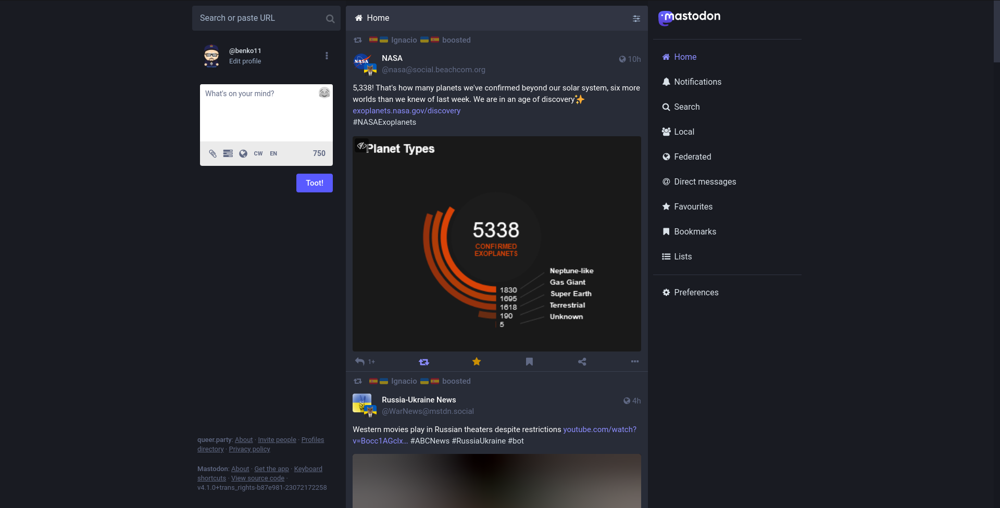
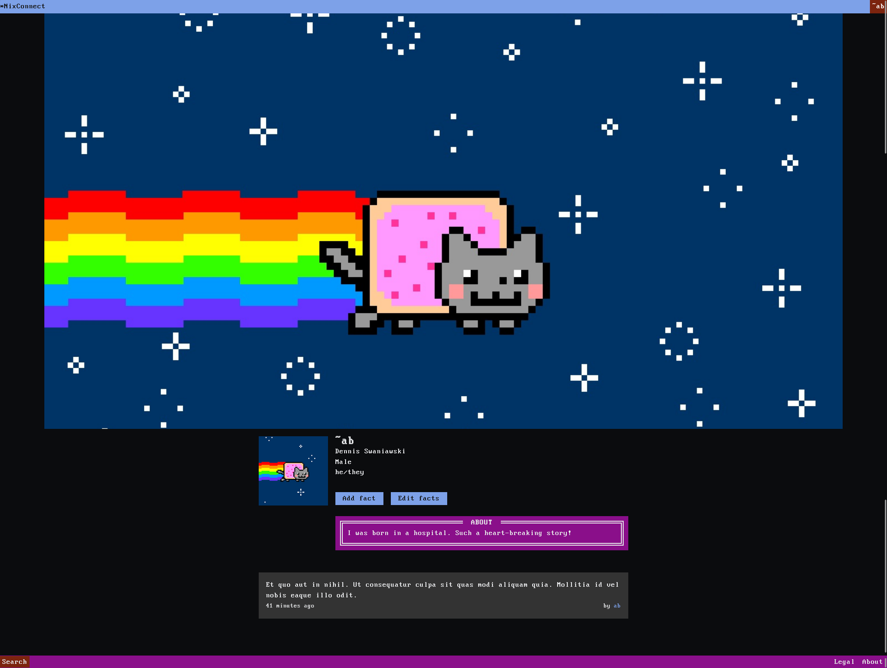
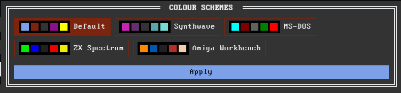
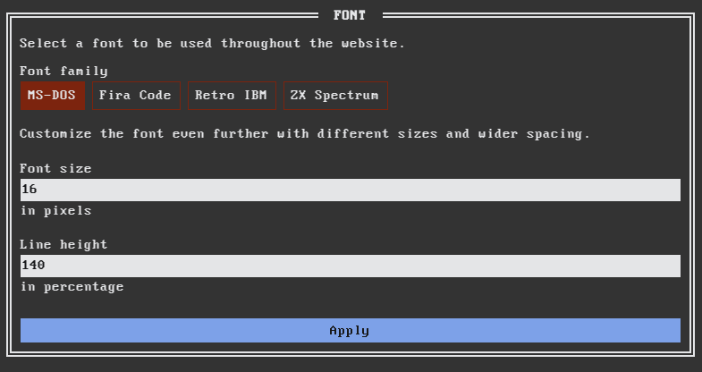
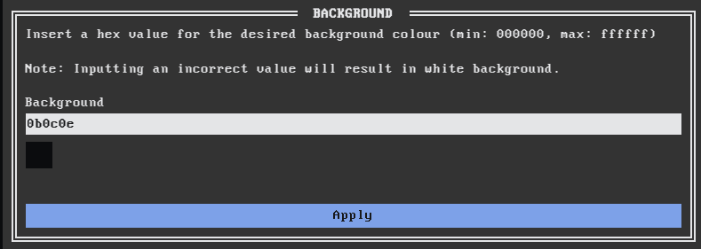

\pagenumbering{gobble}

\newpage

\

\newpage

\


\newpage

\

\newpage
\newpage
\newpage
\newpage


\newpage
\pagestyle{plain}

\pagenumbering{roman}

&nbsp;

&nbsp;

&nbsp;

&nbsp;

&nbsp;

&nbsp;

&nbsp;

&nbsp;

&nbsp;

&nbsp;

&nbsp;

&nbsp;

&nbsp;

&nbsp;

&nbsp;

&nbsp;

&nbsp;

&nbsp;

&nbsp;

&nbsp;

&nbsp;

&nbsp;

**Acknowledgments:** I would like to take this opportunity to thank my supervisor, Dr. Gyárfáš, for accepting the project and offering advice during the process. Another great thanks extends to Samuel, my partner, and other friends for offering moral support during this endeavour. Special thanks goes to Dr. Valkovičová from Pedagogical Faculty of Comenius University as well as everyone else involved in keeping, maintaining and teaching a course on Gender Studies, which offered me considerable insight into developing my own social media platform and its moral code. Last but not least, I am offering thanks to my friends who were willing to participate in user testing and provided feedback, namely Mark and Drea. All of them have made this endeavour possible in a form it is in now.

# Abstract{.unlisted .unnumbered}

The aim of the bachelor thesis is to create a modern web application built around the idea of a social network aimed for the audience with above average knowledge in computer science, namely UNIX enthusiasts. The design will be based around retro/cli/\*Nix style with custom CSS components. Users will be able to create posts with hashtags and they will be addressable to either the public or specified groups of people. Each user must be authorized with their account, and the account is customizable with the custom colour palette, font, and maybe other characteristics. For users to have a more native experience, the application will be SPA, and if time allows, a PWA as well. Technologies in use will include: HTML5, CSS3, JavaScript/TypeScript, PHP, Laravel, MySQL/MariaDB, ReactJS and Git.

**Keywords:** web application, retro aesthetic, social media, inclusion

# Abstrakt{.unlisted .unnumbered}

Cieľom bakalárskej práce je vytvoriť modernú webovú aplikáciu, ktorá je postavená na základe myšlienky sociálnej siete, ktorá je cielená pre publikum s väčšími znalosťami v informatike, obzvlášť UNIX záujemcov. Dizajn bude vytvorený podľa retro/cli/\*Nix štýlu s vlastnými CSS komponentami. Užívatelia budú môcť vytvárať príspevky s tagmi a budú môcť ich adresovať špecifickým ľuďom alebo skupinám ľudí. Užívatelia budú mať prioritné nástenky organizované podľa svojich preferencií. Budú tam aj ďalšie možnosti špecializovanej sociálnej siete. Každý užívateľ musí byť autorizovaný so svojím vlastným účtom a vlastnou farebnou paletou, použitým fontom a prip. ďalšími znakmi. Aby mali užívatelia natívnejší zážitok, aplikácia bude SPA, a ak to bude časovo možné, tak bude aj PWA. Použité technológie budú zahŕňať: HTML5, CSS3, JavaScript/TypeScript, PHP, Laravel, MySQL/MariaDB, ReactJS a Git.

**Kľúčové slová:** webová aplikácia, retro estetika, sociálna sieť, inkluzivita

# Good Faith Declaration{.unlisted .unnumbered}

I hereby proclaim that I developed the thesis in its entirety by myself with the list of provided literature.

\tableofcontents

\listoffigures

# Terminology{.unnumbered}

\pagenumbering{arabic}

**back-end** - term related to all the server logic for a particular application, usually handles verifying and processing data, handling incoming user requests to particular endpoints or structures the database for an object-oriented model

**front-end** - term related to code running on the client, this includes mainly generating user interfaces and providing user interactivity on the website without a full reload

**database** - form of persistent data storage for the application, usually handles the means of retrieving data (declarative approach)

**facade** - design pattern, which allows us to encapsulate a particular API inside our own object implementation to make our code more modular (easier changing of APIs)

**CRUD** - stands for 'create, read, update, delete', and refers to the basic operations performed with data models in the database

**composition** - design pattern, which allows us to implement attributes and methods from multiple classes inside an object without need for multiple-class inheritance, in computer science classes it is often contrasted with inheritance

**SPA** - single-page application, application users can interact with, without full page reloads and only re-rendering parts of the UI (user interface) that need to be rendered

**TDD** - test-driven development, involves writing code in a manner of first writing a failing test, which we subsequently write code for to make it pass making the feature code able to be more easily refactored

**PWA** - progressive web application, it is a modern web application, which boasts additional features compared to traditional web applications, including, but not limited to, offline access, better performance, better integration with the user's operating system (including the filesystem), ability to install and interact with the app as if it were a native app, cross-platform by default

\newpage

# Introduction

Over the last few decades social media have swept the Internet landscape, with the major players having millions, even billions of active users per month. We have taken it for granted that we can share our thoughts, our lives and our achievements at any time from our devices with people around us. We are enjoying our metaphorical 'fifteen minutes of fame' every day, and seek approval of strangers in our actions. We are perpetually online, consuming more and more, and always demanding new content curated to our tastes. Our handy pocket computers are always there to ping us when there is something new happening in our circles.

And we have started to live the significant part of our lives online, communicating and engaging with people that share our opinions, worldviews or interests.

We are living in a world of unprecedented scale never before seen in humanity's history, entrusting significant portions of our lives to private companies with potentially questionable policies for data handling and end goals. And while recent developments have caused a minute shake-up with general population becoming increasingly more aware of risks of providing their data to a third party, and more aware of the effects many social media may have on their lives, social networks by multi-billion companies are still enjoying a sizeable market share, huge profits and significant turnouts.

However, it has not always been like this. It may already seem far-fetched, but not too long ago, the world around us was very different and the landscape of online communication much less sinister. In the following paragraphs, we shall briefly evaluate this evolution from the early days of the Internet to today.

## Brief history of social media

Socialization on the Internet predates even Web itself. In the early 80's of the last century, services such as Public Access UNIX systems (or Pubnixes for short) were servers hosted by computer enthusiasts for communicating and sharing general passions for programming and creating things in software. Such systems are in use and operational to this day, even though, they haven't reached mainstream success or recognizability. One of such systems is [tilde.team](https://tilde.team/). Apart from Pubnixes, Bulletin Board Systems (BBS) provided a primitive (relatively speaking) way of networking multiple computers for messaging, sending files, or even playing games over the Internet inside the command-line. Similarly to pubNixes, BBSs are still in use to this day and have their cult following.

With the invention of the Web in 1991, and web browsers in 1993, the landscape of the Internet changed forever reaching its first mainstream success. One of the earliest examples of socialization on the early Web was through guestbooks people put on their websites. Their implementation varied, some worked by directly embedding HTML to the file, which about breaks all modern security practices. In the early 2000's, social media as we know them began to take shape and reaching first corporate, mainstream success with networks like MySpace and Friendster reaching huge levels of popularity among users and reaching to the point of cultural phenomena (especially MySpace).

However, as we all know, all these successes would not last long, as Facebook slowly, but surely established itself as a place to be in. For a period of time, people without a Facebook account (or social media in general) were considered "untrustworthy" or "shady". Facebook were also one of the first to pioneer and master the power of psychology in order to create a product where users spent as much time in order to show as many ads as possible, which generated tonnes of controversy, although these days this has been mastered and crafted by virtually every other commercial social media platform in existence. We have seen TikTok reaching unprecedented and previously unheard of levels of growth with their strategy. Not only that, but TikTok has directly or indirectly influenced nearly every other social media platform it competes with to the point that virtually every social network nowadays includes some form of short-sharing capability.

## Motivation

We have established that the market of social media is extremely saturated and cut-throat, and it may appear vain endeavour to try to saturate it even further; it is practically impossible for a single student to try entering it and hope to succeed. This, however, is not the motivation for creating our own social media platform, and the goal behind is much humbler, even if somewhat underwhelming.

The goal behind our own social media platform is to create a small-scale system that would be enjoyable to use for the author and their friends. It is aiming to create the ideal online environment for the author and other like-minded people to communicate and share whatever they deem necessary or pleasurable in a safe environment, environment that is not exploitative of human's dopamine releases, but the one that connects people without an ulterior motive.

We have mentioned like-minded people to the author, but it is worth exploring this value. What like-minded people are the prime target for our social media network? The prime target audience for our social media network will be the crowd of computer enthusiasts, particularly those who are interested in creating software, little programmes, and like sharing their work with others.

Still, this philosophy of creating free software, little programmes that are trying to do one thing and do it well, this philosophy is very similar to UNIX philosophy from the 70's. The author themself is a daily Linux user and a UNIX enthusiast, and it seems the perfect match to try to create a social media platform for the more technically inclined populace, the UNIX and software enthusiasts, and everything in between.

Therefore, we are going to create a social media platform for this target population. In the true spirit of open-source software, its code will be publicly available to anyone who wishes to run their own instance of the software and modify it to their own whim will have an option to do so. There will, however, be safeguards in place to prevent any misuse of the software, whether it be for creating online communities with the goal to spread and incite hatred or try to perpetuate societal inequality; these points will be discussed later on.

We are also going to limit any monetary gains from our software to keep the spirit of being free and open-source intact with the respective software licence. All of these points shall be included in the software licence that is going to be included with the software repository.

### Why Not Mastodon?

Mastodon is one of the most popular open-source social networks that has been taking the world by storm in recent years. It takes pride in being completely open-source and in being free of charge for use by anyone, allowing anyone to whip up their own Mastodon server and create their own community. It also integrates into the Fediverse, which is essentially a network of networks where people from other Mastodon servers can communicate and interact with users from other servers allowing for intercommunication between servers with moderation options included (some servers have a list of servers that are either completely banned from intercommunication or significantly hindered).



It may seem vain with such a project already in full force to try and create a new one from scratch. However, there are still valid arguments present for the existence of yet another social network. First and likely most important is the particular communication facet that Mastodon (and other social networks) are exploring. Mastodon's aim is to create an open-source microblogging platform. Our goal is to create a social network that caters to an unexplored and possibly underdeveloped facet of online communication, keeping the 'smallness' of the project and its communities in mind.

Second, we are going to offer a unique feature set compared to other social media, in a unique visual language that aims to deliver the cosy and comfortable experience, at least for those who are UNIX or retro tech enthusiasts.

Third, it is author's passion project, opportunity for them to explore creating a larger application, put into test their amassed knowledge and experience from the years to be able to create a dream project, a safe haven for themself and maybe others to post to and interact with, and, of course, learn new things and technologies on the way.

## Foundations

We are going to bring down together the marriage of retroism and modernity to create a unique web application, one that stands out. Retroism will be embraced in the design and visual department, modernism on the other hand will be embraced in the technology stack and modern responsive and accessible guidelines for developing web applications.

In order to fully establish our application's identity, we should probably give it a name, ideally one that isn't overly long and complicated. Original name for the project was meant to be **\*NixBook**, however it was later changed to **\*NixConnect** so as not to seemingly draw inspiration from the monopolistic and predatory landscape of a certain social media platform.

Technology stack that we will be using is: Laravel/ReactJS/Inertia/MariaDB. Integration of Laravel (and PHP language in general) with SQL databases is very good, so it allows us to get up to speed in that regard as quickly as possible. ReactJS will be used for webpage rendering on the frontend and that we will be also using it to make an SPA application (single-page application).

While we could be specifically designing an API in Laravel (backend) and use `fetch` APIs to generate the content from those APIs on the frontend, there is an easier way.

As it turns out, there is a library called [Inertia](https://inertiajs.com/) that acts as middleware between server and client and allows us to seamlessly fetch and manipulate server data without need for extra `fetch()` calls on the frontend, instead allowing us to obtain this data from site component props. Once we get to see this library in action, it will be clear what its advantages are.

\newpage

# Design

Now that we have laid out the basics for the application, it is about time we start writing some code. A full-stack web application consists of both back-end and front-end working together and providing a coherent experience without the end user even having to know the difference.

Database too can be considered a separate component of the application, and we shall see in the future, it is the layer that communicates with the back-end, which communicates with the front-end. Some data will be passed in this manner directly to the front-end, such as the list of colour schemes or the list of fonts, these and other features will need to be available in the application globally.

Since database is the backbone for both back-end and front-end, we shall start with the database design first.

## Database

Database is the essential layer in our application. It will be the layer providing us with the list of users in the application, the posts they share, other accounts they follow, and it will also be an integral part of customization features, and much more. It is therefore imperative that it is designed in the most efficient and normalized way possible, adhering to normalization rules and establishing unchanging naming conventions.

Fortunately for us, Laravel makes this process much simpler and more enjoyable by utilizing the built-in `Schema` facade and in creating so called migrations. Migrations can be thought of as database blueprints; they contain more human-readable code for creating particular tables in the database without needing to write a single SQL query in the process.

Each migration file contains two methods `up()` and `down()`, the former contains the logic for our actual migration and the latter undoes the operations of that migration (e.g. dropping a table that was created). We refer to this process as 'rolling back', however it is not used extensively during the development of this application, as running `php artisan migrate:fresh` does this logic for us (drops all the tables in the database and re-runs all migrations, regardless of the `down()` method).

As we have established, it is quite frequent during the development process to practically reset the entire database and start from scratch. This poses a problem; what if we want to keep testing the application and be signed up as a certain user, but resetting the database every time means we would have to manually create an account every single time! This is where seeders come to play.

We shall talk about seeders in more detail later, but for now think of seeders as classes that will populate our brand new database with data automatically. Running `php artisan migrate:fresh --seed` runs both of these processes at once - it resets the database structure and populates it with dummy data for testing on the fly.

### Migrations

Let us now design a brand new database for our application. Due to space constraints we shall only mention some of the migrations, and some of the details will be omitted here; it is recommended to consult the actual codebase along with this text.

The most integral part of a social media platform is, of course, its users. We want this table to contain personal information about each user, as well as sign-in data. This is what the migration for the `users` table looks like (for brevity, only the definition of the `up()` method will be referenced here and all future migrations, unless stated otherwise).

```php
Schema::create('users', function (Blueprint $table) {
    $table->uuid()->primary();
    $table->string('nickname')->unique();
    $table->string('first_name')->nullable();
    $table->string('last_name')->nullable();
    $table->string('email')->unique()->nullable();
    $table->timestamp('email_verified_at')->nullable();
    $table->string('password');
    $table->date('date_of_birth')->nullable();
    $table->text('bio')->nullable();
    $table->timestamps();
    $table->timestamp('toured_at')->nullable();
    $table->softDeletes();
});
```

Let's examine this migration line by line:

`uuid()` - creates a primary key column in the database, but instead of incrementing number, it uses UUIDs for identification.

`string(name)` - creates a `varchar` column in the table with the name of `name` of size `255`

`unique()` - adds a database constraint for the particular column meaning that one value cannot be repeated twice in the same column. This is instrumental as we are planning to make the user's nickname an identifying element across the entire site.

`nullable(param)` - allows the value of a particular column to be empty or `NULL`. We are using this, because most types of personal information are optional. In case of `email_verified_at` and `toured_at` these are used as booleans, meaning that no date amounts to false and some date amounts to true; this is useful for email verification and first-tour process. If `param` is set to `false`, the column is explicitly not nullable.

`timestamp(name)` - creates a `timestamp` column, which contains a particular date and time.

`date(name)` - such column only contains a particular date.

`text(name)` - `text` column for storing up to 64 Kilobytes of text.

`timestamps()` - helper method that automatically creates columns `created_at` and `updated_at`, which are updated when the entity is created and modified, respectively.

`softDeletes()` - helper function that allows for soft deletion, meaning that the user is still present in the database, but appears as non-existing to the public. Contains a special nullable `deleted_at` timestamp, which signifies the soft deletion of a particular entity if it is not empty. This is used for giving users a grace period before their account is permanently removed.

The `genders` table contains the list of genders, followed by the table `gender_user`, which is the pivot table between users and genders having a `M:M` relationship. The name `gender_user` is followed by Laravel's conventions for pivot table names, having both tables in singular in alphabetical order.

```php
Schema::create('genders', function (Blueprint $table) {
    $table->id();
    $table->string('name');
});

Schema::create('gender_user', function (Blueprint $table) {
    $table->unsignedBigInteger('gender_id');
    $table->foreignUuid('user_uuid')->nullable(false);

    $table->primary(['gender_id', 'user_uuid']);

    $table->foreign('gender_id')->references('id')->on('genders');
});
```

Let's examine new methods:

`id()` - creates a unique primary key for the table, but uses incremented numbers (big unsigned integers), instead of UUIDs

`primary(key)` - declares a primary key in the table. If an array is provided with more than one key, the primary key will be composite, that is, the unique combination of user and gender (one user cannot have the same gender twice, e.g. be `Male` and `Male`).

`foreign(key)->references(id)->on(table)` - declares a column of `key` to be the foreign key, referring to the column of `id` in the `table`

The exact same logic applies to `pronouns` and `pronoun_user` (you can view it in the codebase).

One of the rudimentary features of a social media platform is to be able to follow other accounts. We implement this logic in `follower_user` table (once again `M:M` relationship, as one user can follow many users, and user followed can be followed by many users):

```php
Schema::create('follower_user', function (Blueprint $table) {
    $table->foreignUuid('user_uuid');
    $table->foreignUuid('follower_uuid');

    $table->primary(['user_uuid', 'follower_uuid']);
});
```

Next we have the table of `user_media`. This table is an extension of `users`, but contains information about user's profile and banner pictures, as well as the positioning of the banner picture. It is in a `1:1` relationship, as information about the media is specific for each user, in other words, each user has one media entity assigned to them, and each media is assigned to one user.

```php
Schema::create('user_media', function (Blueprint $table) {
    $table->foreignUuid('user_uuid')->primary();
    $table->unsignedBigInteger('avatar_id')->nullable();
    $table->unsignedBigInteger('banner_id')->nullable();
    $table->float('banner_pos_x')->default(0.5);
    $table->float('banner_pos_y')->default(0.5);
    $table->timestamps();
});
```

The new definitions:

`float(name)` - makes a column of type `double(8, 2)` in the table named `name`
`default(value)` - sets the default value for a particular column

The same logic as with genders and pronouns will apply to facts as well (`facts`, `fact_user`). A fact can be thought of as an optional characteristic user wants to make public about themselves, e.g. favourite colour, favourite music band, religion, etc.

Next we have `fonts` that users will be able to choose from on the website:

```php
Schema::create('fonts', function (Blueprint $table) {
    $table->id();
    $table->string('name');
    $table->string('url');
    $table->enum('type', ['monospace', 'serif', 'sans-serif']);
});
```

New definitions:

`enum(name, values)` - defines a column of type `enum` and name `name` with possible values being specified in the `values` array

Since we want the user to be able to keep track of their previous avatars on the site (unless they removed them), we are going to keep track of all the avatars all users have collectively stored (the one in use is determined by the `avatar_id` value in `user_media`):

```php
Schema::create('user_avatars', function (Blueprint $table) {
    $table->id();
    $table->foreignUuid('user_uuid')->references('uuid')->on('users');
    $table->string('name');
    $table->timestamps();
});
```

`avatar_id` is referring to `id` in `user_avatars`. However, since this table did not exist at the time of creating the `user_media` table we were not able to make a foreign key reference at the time, but now we have both tables available, so let's make an additional that will add this foreign key constraint (the contents of the entire migration class):

```php
public function up()
{
    Schema::table('user_media', function (Blueprint $table) {
        $table->foreign('avatar_id')->references('id')
                                    ->on('user_avatars')
                                    ->onDelete('cascade');
    });
}

public function down()
{
    Schema::table('user_media', function (Blueprint $table) {
        $table->dropForeign('user_media_avatar_id_foreign');
    });
}
```

Notice the `down()` method only reversing the effects of the respective migration, in this case instead of dropping the entire table, we are only removing a particular foreign key reference.

We are going to apply the exact same logic to banners (`user_banners`, `user_media`):

```php
Schema::create('user_banners', function (Blueprint $table) {
    $table->id();
    $table->uuid('user_uuid');
    $table->string('name');
    $table->timestamps();
});

// We are once again only including the contents of the up() method
Schema::table('user_media', function (Blueprint $table) {
    $table->foreign('banner_id')->references('id')
                                ->on('user_banners')
                                ->onDelete('cascade');
});
```

Next, we have colour schemes, which will influence the website's look and allow users to personalize their experience:

```php
Schema::create('colour_schemes', function (Blueprint $table) {
    $table->id();
    $table->string('name');
    $table->string('primary');
    $table->string('secondary');
    $table->string('tertiary');
    $table->string('quaternary');
    $table->string('foreground');
    $table->string('foreground_dark');
    $table->string('error');
    $table->foreignUuid('user_uuid')->nullable()->unique();
});
```

We shall talk further about colour schemes in Implementation.

Preferences will be the backbone of user customization, they will include references to aforementioned colour schemes and fonts, and other properties that will be customizable by the user:

```php
Schema::create('preferences', function (Blueprint $table) {
    $table->id();
    $table->string('title');
    $table->string('slug')->unique();
    $table->bigInteger('default');
});

Schema::create('preference_user', function (Blueprint $table) {
    $table->foreignId('preference_id')->references('id')->on('preferences')
    $table->foreignUuid('user_uuid')->references('uuid')->on('users');
    $table->bigInteger('value');
    $table->primary(['preference_id', 'user_uuid']);
});
```

As with genders and pronouns, we are using a `M:M` relationship, as one user can have many preferences, and one preference can belong to many users (e.g. each user has the ability to customize the colour scheme). The `preferences` table lists the preferences that will be settable by each user and also specifies the default (e.g. when creating a new account).

Next, we are going to talk about the nitty-gritty of our application - the posts. Here we are going to apply polymorphic relationships in the database. Similarly to OO, where polymorphism means a method having multiple forms and being able to be overridden, and therefore have many forms, in databases, applying polymorphic relationship means we can have posts of different types, and each of these types has unique underlying database structure. The base table `posts` is underwhelmingly simple:

```php
Schema::create('posts', function (Blueprint $table) {
    $table->id();
    $table->foreignUuid('user_uuid')->references('uuid')->on('users');
    $table->morphs('postable');
    $table->timestamps();
});
```

Here you can notice the new `morphs(name)` method, which creates two columns behind the scenes. One is of type `varchar` (just like `string()` method) and refers to the model we are going to be working (we have not talked about models yet, but for now consider them object representations of particular database tables, they are classes, which have the table name as singular). Second property is an unsigned big int, which refers to the model id, that is, the id of a column in a separate table (denoted by model). The column names are, respectively, `name_type` and `name_id`.

We have four types of posts to consider:

`text` - contains plain text, no media \
`gallery` - allows uploading custom pictures, adding descriptions to each as well as a common description for all images \
`code` - allows uploading code snippets (and choosing a particular coding language for syntax highlighting) and adding a text description to it \
`article` - is for longer text, body supports Markdown formatting, it also has its own separate title

We are going to declare separate tables for each type respectively, with the table names of `posts_text`, `posts_gallery`, `posts_code`, `posts_article`. Each of these tables will have an ID referring to the post from `posts`. In addition, there will be a table `posts_gallery_images`, which will contain all images contained within each particular gallery post, and will contain an ID reference to the original `posts_gallery` post.

There are also some other tables, namely for likes and shares, under `pings` and `forks` respectively (we shall explain this nomenclature in a future chapter), and a table `stash` for storing posts or shares that users have saved for themselves. It also makes use of polymorphic database relations, given that user can stash either a post or a share (fork).

### Seeders

Now that we established migrations, let us move on to seeders. During application development, there are certain entities that we work with very often, that we need to keep generating over and over. There is also the data that will be deployed to the application by default, such as the list of fonts or colour schemes - these properties will be used not only for development purposes, but the production as well.

Each seeder is a class extending from the base `Seeder` class containing the method `run()` that executes some logic on an already existing (but presumably empty) database. We create a new seeder in the console by typing in `php artisan make:seeder <seeder_name>`.

We can populate the database with hard-coded values (used when we are creating the same administrator account) or dynamically generated values (when we want to have 100 users to work with).

In order to dynamically create data, we use factories. Factories are blueprint classes that specify the format of dynamically inserted data. There is a helper function in Laravel called `fake()`, through which we can call other methods and get dynamically inserted data tailored to our needs. For instance, if we have a column of `first_name` in our table, we can ask for a random user name by simply typing `fake()->firstName()`; this will return a random first name. There are many other options for random data, such as last names, random words, random dates in a specified time interval, random paragraph or a number of paragraphs. Moreover, if we have a unique column in our database, we can pass the unique method to the `fake()` call, such as for unique emails, we would use: `fake()->unique()->safeEmail()`.

```php
return [
    'first_name' => fake()->firstName(),
    'last_name' => fake()->lastName(),
    'nickname' => fake()->unique()->word(),
    'date_of_birth' => fake()->dateTimeBetween('1950-01-01', '2003-01-01')
                             ->format('Y-m-d'),
    'email' => fake()->unique()->safeEmail(),
    'email_verified_at' => now(),
    'password' => 'password',
    'remember_token' => Str::random(10),
    'bio' => fake()->text()
];
```

Once a model factory is defined (in the aptly named `definition()` method), we can make calls on the factory like so: `User::factory()->count(100)->create()`. This creates 100 rows of user entity and saves them the database. If we only want to generate the data, but not persist, we can call the `make()` method, instead of `create()`. We can also provide it with the `raw()` method, which works just like `make()`, but instead of a Laravel Collection instance, it returns an array.

Here is the contents of the `run()` method in `CodeLanguageSeeder`, which generates and persists the list of programming languages that can be used in posts containing some code (referred to as 'code post'):

```php
$languages = [
    'C' => 'c',
    'C++' => 'cpp',
    'PHP' => 'php',
    'JavaScript' => 'javascript',
    'Java' => 'java',
    'Python' => 'python',
    'TypeScript' => 'typescript',
    'Rust' => 'rust'
];

foreach ($languages as $language => $slug) {
    CodeLanguage::create(['name' => $language, 'slug' => $slug]);
}
```

We can observe that the seeder classes perform no additional logic, and are only performing the basic inserts using Laravel's object model. For a better picture, here is an example of a seeder using factories:

```php
User::factory()->count(100)->create();
// add media, preferences, genders and pronouns ...
```

Our application contains seeders for an array of entities: `code_languages`, `colour_schemes`, `fonts`, `genders`, `preferences`, `pronouns` and `users`.

## Back-end

In this section, we are going to talk about the back-end design of \*NixConnect. Our application is based on Laravel, which already supplies us with a sizeable, but malleable boilerplate for our application. Rather than describing the structure of a Laravel application in detail, we are going to focus on some key points, around which the application is built.

One of the main design patterns used in the Laravel framework is called MVC (model-view-controller), where:

-   **model** - represents the data point, it handles all CRUD operations
-   **view** - displays the data from the model
-   **controller** - handles user input, retrieves data from model and passes it onto the view

### Directory structure

We want to keep our code tidy and organized; with Laravel we are provided a robust and scalable structure, we are going to talk about it:

`app` - contains all models, controllers, as well as middleware, requests, custom validation rules and traits

`config` - provides configuration information for multiple ends of the application, global application data, authentication settings, mail settings, database preferences and so on. Each value can be overridden by a value from the `.env` file (not available by default, but you can set up your own use case by copying into it the contents of `.env.example`)

`database` - contains migrations, factories and seeders for the application

`pdf` - generated PDF version of this thesis, along with extra assets used in it

`public` - standard endpoint for the client, contains public assets (such as font files or other default assets) as well as a pointer to the public storage location (for users to be able to upload custom avatars or banners)

`resources` - has all front-end logic, we shall cover that in the next section

`storage` - contains files such as user uploads (after linking it with the `public` directory), as well as application logs

`tests` - contains backend tests

### `app` directory

Inside `App\Models` we can find all the object models used in the application, such as `User`, `Preference`, `ColourScheme`, `Gender`. Each one of these classes represents a respective database table that we can use. Inside these classes we can customize the ways we work or want to work with models, for instance, by default Laravel creates a plural of the model name and considers that the table it is going to retrieve, however it can be overridden.

Other properties we can override include adding rule to always include certain relationship when working with a respective object, or how particular model attributes are handled when it comes to getting or setting, or the primary key name (`id` is default). We can also set up fillable properties (for security reasons), relationships with other models (`1:1`, `1:M` or `M:M`) or helper methods for interacting with particular objects in relation to the one currently in use.

We do not create models for pivot tables in `M:M` relationships, as this is handled by overriding parameters in respective relationship methods (`belongsToMany()`). You can also notice grouping of related models, for instance `PostTypes`, which relates to all kinds of tables that handle different post types.

Sometimes we have a need to split logic of related model logic into multiple files in order to prevent having a massive file. We can achieve that with traits (stored in `App\Http\Traits`), which make use of the composition design pattern.

Inside `App\Http` we can also find all the controllers for the application (`App\Http\Controllers`), which represent logic to be executed in particular URI endpoints (refer to `routes/web.php`). You can also notice once again groupings of certain classes, for instance, all code for the settings resides inside the `Settings` directory. These controllers usually include server-side validation for particular resources using Laravel's built-in Validation API (there are custom validation rules in `App\Rules`).

Inside `App\Http\Middleware` we can find some middleware that is executed for particular URI endpoints. There are some built-in ones, such as verifying if user is logged in (`Authenticate.php`), verifying CSRF tokens (`VerifyCsrfToken.php`), even InertiaJS, which turns our application into an SPA, is just middleware sitting about. There is also middleware like `FirstTour.php` or `NoTour.php`, which check if the user has completed (or not) the sign-in tour of the application and performs respective redirects if needed (majority of the application cannot be accessed without completing the tour).

Inside `App\Http\Providers` we have global providers that give us extended global functionality or data in the application. For instance, inside `AppServiceProvider.php`, we are providing both custom relational mappings for polymorphic relationships in the database as well as global data to be accessed across all front-end components (`Inertia::share`).

### `tests` directory

Here we have some user and feature tests for the back-end. It is important to note that the codebase of \*NixConnect does not have 100% of use cases covered (not even close). It serves more as an illustration of the feature and of author's brief stint in TDD. A couple of features on the website have been developed in this way (mainly relationships between database models).

Some of these tests are also feature tests, but these tests have been adopted from the Laravel boilerplate codebase.

### `routes` directory

A file of interest in this directory is `web.php`, which contains the definitions of all URI endpoints in our application.

## Front-end

Since we are developing a Laravel application, it might be trickier to implement ReactJS from scratch including implementing user accounts, user authentication and authorization. With the SPA approach, we would likely need to make use of JWTs (JSON web tokens), and global states using React context or using external libraries like [Redux](https://redux.js.org/).

Fortunately for us, developers at Laravel have considered this to be a frequent use case, and have tweaked it for maximum comfort and ease of use for the rest of us. In order to convert our server-side generated website with full page reloads while moving between pages, we need to couple our application with InertiaJS library, and ask for ReactJS boilerplate code.

We can achieve this effect by running:

```
composer require laravel/breeze --dev
php artisan breeze:install react
```

This will convert our application to an SPA, with a more PWA-like experience. When running the application it is necessary to also run the front-end Vite server with `npm run dev`, along with the usual `php artisan serve`.

### Directory structure

Our front-end portion of the application resides inside the aforementioned `resources` directory, specifically inside `resources/js` directory where all of our ReactJS components and front-end logic reside. This directory contains the following root directories and classes:

`Components` - this application contains custom components used throughout the entire application, they contain the core definitions for components for image carousels, code blocks, custom dropdown menus and more. These files also contain definitions for other auxiliary components if those components are going to be local to the respective component file they are inside of (for instance, `CarouselContainer` definition is contained within the `Carousel` file, as this container is only present and used inside the original `Carousel` component as a helper function).

`hooks` - this directory contains custom hooks, which are essentially files with custom logic that is used across the entire application, for instance, `usePostData` hook accepts the post object of any type (text, gallery, post or code) and it converts this object into a unified data object structure, which is then used across other components, like ones for editing and deleting posts.

`Layouts` - here we have all the layouts used across the entire application. **\*NixConnect** makes use of two specific layouts, one for users who are not signed in to provide them with an experience to create an account or log in (called `GuestLayout`), whereas the other layout called `AuthenticatedLayout` is for users who have been authenticated and are signed into the application to provide them a more native experience for signing out, previewing profile information or setting account information or preferences.

`Pages` - this directory hosts the endpoints for specific URI endpoints. These are the files that are hit as user walks throughout the application, and you can identify them more clearly by searching for `Inertia::render` method calls inside respective controllers (detailed instructions are hosted inside `routes/web.php` file). Apart from those files, this directory also hosts that are directly pertinent to and local to the particular endpoints, i.e. UI elements that comprise a whole page.

`Styles` - similarly to `Components`, this directory hosts all the custom CSS styles for custom components based on top of the `styled-components` library. These components allow us to embed CSS stylings directly into our ReactJS components, which we can use across the entire application freely, just like regular ReactJS components. Components that are more appropriate to be merely CSS definitions, rather than fully-fledged ReactJS components are provided in here, including definitions for custom `Textarea` elements or modal windows (inside `ModalWindow`).

`app.jsx` - is the entry point for the entire front-end portion of the application. This file is the equivalent to a root component inside a ReactJS application. A root component is a component from which the entire application springs up to life and is defined. In case of InertiaJS projects, it also defines the path from which components are loaded inside the back-end controllers, that is, it defines that all API endpoints are going to be defined in the `Pages` directory. Lastly, it wraps our entire application inside the `AppWrapper` component.

`AppWrapper.jsx` - is a custom global component for the entire application, which implements the functionality of global context, that is, globally available objects that can be accessed from across the entire application. This wrapper is used to implement custom user theming, including the ability to change the colour scheme, background and the font family used across the application. It provides a global theme object, and a modifier function to allow us to modify on the fly.

Let us investigate some of these directories in a little bit more detail, just like we did last time with the back-end.

### `Components` directory

Here we are going to find other sub-directories, such as `Forms`, `Post` or `Profile`. Components inside `Forms` represent our custom-made form components that we use in the application, such as the custom checkbox implementation (selection of one or more choices from the list), custom radio implementation (selection of one choice from the list) in order to provide a more bespoke retro experience.

Inside the `Post` directory we will the definitions for all components related to posts including custom wrapper classes to display specific types of posts, as well as modal windows for custom actions on the posts, including forking (sharing) posts and editing or deleting them.

Things related to user profiles are contained within the `Profile` directory, and it includes fact modals (for adding or deleting a user fact) as well as the implementation of a posts' feed that displays the actual feed of posts from a source (respective user profile or all followed accounts on the homepage). (Term 'feed' is equivalent to 'wall'.)

Other custom components present in this directory include `ColourSquare` for displaying a colour square of a specific size and background colour (used for avatar placeholders or defining colour schemes inside settings), a custom `Dropdown` implementation for dropdown menus (used in settings), a custom `Modal` which all modal window implementations make us of, and lastly, and also a custom `Window` component used for creating hierarchy inside user settings and other pages.


### `Pages` directory

Sub-directories found here include `Auth` for creating access point for all authentication-related matters, including creating a new account, verifying an email address, logging in as well as providing first-time tour of the application. Tour of the application runs upon user's first successful log-in and is meant to guide user throughout the application as well as give them some extra opportunities to further customize their profile before they start using the application for the first time.

`Home` directory contains all the components used on the homepage, in this case it's the homepage itself and all the forms that are used to post new posts of respective types.


`Profile` directory contains the definition for a user profile, as well as all auxiliary components used on the webpage, including displaying a banner image (`<BannerImage>`), follow button for a user profile (if a user is viewing a different profile than their own) and a user profile picture (`ProfilePicture`).

`Settings` directory similarly to `Profile`, contains the endpoints and helper components for all the user settings endpoints user can reach. Further hierarchization into subdirectories structures the settings portion according to how the settings UI is structured and laid in front of the user with each subdirectory representing a different section of the settings.



\newpage

# Implementation

In this chapter we are going to describe implementation details of some features in **\*NixConnect**. We are going to establish the fundamental feature set for the application and discuss the approaches used for accomplishing completion of these features. Part of the implementation also involves real-life use cases, which is why we are going to look at the reports from the usability testing conducted on real users.

## Feature set

Let us talk about some features that are fundamental to the application. **\*NixConnect** is a social media application with a unique retro aesthetic. While some of its features do share similarities with other forms of social media, such as engagement in the form of liking or sharing other people's posts, it is the application's aim to try to rephrase or rethink these core social features in a way that allows for a more engaging experience.

The features we are going to discuss here are:

-   unique, retro aesthetic with custom-made UI components
-   rethought and reimagined social media features
-   customizable experience for each user
-   privacy-preserving and inclusive environment

## Aesthetic

We can think of designing a user interface as a sum of its smaller parts. Every complex user interface comprises smaller UI components (this is also one of the fundamental notions of developing ReactJS applications). In order to be able to deliver a cohesive and polished experience to the end user we need to think about each UI element in our application as a separate entity and establish a design hierarchy that is consistent with the rest of the application. We can achieve that by designing a set of universal components that we can use throughout the application.

Let us talk about some of these components in more detail and describe their use cases inside the application:

### `<Window>`

This component adds hierarchy to some views. It is used to encompass a page or a section of a page, for instance, in case of user settings, each individual window represents separate sub-section of the settings panel. In case of sign-up or log-in forms, it adds character to the views.

Component's aesthetic is characterized by two solid lines encompassing the entire section with an optional title on top. This is similar to a design aesthetic used in some command-line applications from the 90's.

We have already seen an example of a use case for this component (from one of the settings panels), here another example is included this time from the login screen with the default colour scheme applied:


Here is an example of code implementation of this component:

```jsx
<Window colour="var(--tertiary-colour)" title="Log in">
    ...
</Window>
```

A couple of properties stand out here, first is the already aforementioned `title` property, which is optional and provides a title for a particular `<Window>` instance. `colour` property is mandatory, and can be set to any colour. In this case we are using a CSS variable for a specific theme implementation (we shall talk about themes in the customizability section), `tertiary-colour` usually means a shade of a neutral shade of grey, but other colours can be used at will.

Other optional properties include `className` for implementing custom CSS classes for a window, and `children`, which means that the component can have children inside of it, similarly to how HTML works. For brevity, in the future usage of `children` property will be assumed automatically based on the respective example implementation provided. `className` property will also be excluded from the specifications, as its use case is always identical.

### `<TabbedMenu>`

This component serves to create a little mini navigation, where user can select between items from the top, and different UIs will be rendered on demand. This menu can be thought of as an implementation of a so-called "tabbed interface", and it is in use inside the `<Home>` section of the application where user picks between different types of posts they want to create and share.


Below is an example of code implementation:

```jsx
<TabbedMenu
    className="my-2"
    items={{
        Text: <TextForm />,
        Gallery: <GalleryForm />,
        Code: <CodeForm codeLanguages={props.codeLanguages} />,
        Article: <ArticleForm />,
    }}
/>
```

Here we have the `items` property, which creates our tabbed navigation. each item in the object consists of a key, which is the name of the section displayed on top, and the value is the component to render for that particular value. By default the first item of the object is selected.

### `<RadioSelect>`, `<CheckboxSelect>`

These components are both custom implementations of radio (for one choices) and checkbox selection (for multiple choices). They are distinguished by using different colour palettes and having different spacing between them (radio buttons are separated with a gap, whereas checkbox items flow continuously).

Here are examples of what they look like as well as code implementations:


```jsx
<RadioSelect
    name="language"
    value={lang.slug}
    label={lang.name}
    onChange={(e) => {
        if (lang.slug === language) {
            setLanguage("");
            return;
        }
        setLanguage(lang.slug);
    }}
    checked={lang.slug === language}
/>
```


```jsx
<CheckboxSelect
    name="genders"
    label={gender.name}
    value={gender.id}
    onChange={handleGenderChange}
/>
```

Both of these components use `name`, and `value` properties, which are equivalent to the attributes of the same name for HTML `<input>` properties. `label` references the text visible to the user on a webpage, and `onChange` represents the logic for handling the state of selection in the parent component. (ReactJS operates with states and properties in a unidirectional way, meaning that for child component to interact with its parent component, it needs to have the logic of the parent component passed down as a property.)

### `<ImageUpload>`

This component is the custom implementation of `<input type="file" />` HTML element, which provides a more unique and more native experience that is in line with the feel of the entire application. It provides a custom UI for uploading files, and it also supports drag-and-drop of one or multiple files, as well as restricting the mimetype of uploaded files and a maximum size of each individual file. It also supports embedding of custom messages to be displayed in particular scenarios.

As always, let us take a look at an example code and visual implementation:

```jsx
<ImageUpload
    uploadMessage="Upload images for the post"
    dropMessage="Drop files here to upload them"
    errorMessage="One or more images are invalid ..."
    maxSize={5}
    maxHeight={650}
    onUpload={handleGalleryUpload}
    submitted={submitted}
    setSubmitted={setSubmitted}
    multiple
/>
```

`uploadMessage`, `dropMessage`, `errorMessage` are all properties that are displayed under different component states. I believe the descriptions along with the images below will provide a self-explanatory overview of how the component works. `maxSize` property restricts the maximum size of each uploaded file (with the number specifying the file size in mebibytes). `maxHeight` is useful if user uploades too many images, this property restricts the maximum height of the image preview and adds a vertical scrollbar if that specified height (in pixels) is exceeded.

`onUpload` property once again works as a way of passing logic from a parent component down to the child component. `submitted` and `setSubmitted` pass the state of the same name from the parent component down to the child component, and it is used for resetting any previews in the original window upon user making a successful request. `multiple` request is a boolean property, which handles if user can upload multiple files down to the component at once, it also display the total number of uploaded files.

Let's take at this component in action:


### `<Modal>`

Modal windows represent additional actions that user can perform on certain resources. They break flow of the entire application displaying an opaque overlay over the entire screen. They present an immediate challenge to the user to resolve, such as confirming certain actions like post deletion or post sharing (forking). These action can be dismissed by the universal "Close" button at the bottom of the window.

Each implementation of the `<Modal>` component makes use of composition by directly embedding the original `<Modal>` component into a new function and adding respective settings. Let's take a look at an example of `<DeleteModal>`. Here is the function definition:

```jsx
<Modal show={show} onClose={onClose}>
    <form onSubmit={handleDeletePost}>...</form>
</Modal>
```


Here we are passing two of the props of `<DeleteModal>` to the `<Modal>` child component where, one for handling if a particular model should be displayed (`show`) and one for handling the closing of the modal window. Same pattern of passing logic from parent components to the child in a unidirectional flow is applied. Lastly, we include the contents of the modal window and add some desired UI or logic into it.

The keen-eyed amongst the readers may have noticed from the picture above that the design is somewhat similar to the installation prompts of older applications or CLI-based operating systems, which with all other components, attempts to establish the unique retro experience and flow of the application.

### Other components

There are many other custom-made components in the application comprising the UI of the application, however, due to space constraints of this thesis, they will be omitted from detailed descriptions.

Some of the components bearing the worth of being mentioned are the `<Carousel>` component, which displays a group of images in a carousel environment, with both 'Previous' and 'Next' buttons and is used for displaying images in a gallery post. There is also `<CodeBlock>` component, which displays code with respective formatting for a particular programming language (passed as a property), it is used in a code post. `<Dropdown>` component allows for a dropdown to be displayed on a webpage, upon user clicking a particular button and is used for displaying the navigation for authenticated users if they click their username in the top bar.

Forms also have custom implemenation with ones like `<TextareaInput>` or `<TextInput>` used for wrapping around HTML `<textarea>` and `<input>` fields, respectively. There are also `<InputError>` and `<InputErrorInfo>` for displaying error messages in forms to signify user needs to change something in their previous input.

## Social media features, reimagined

Liking or sharing posts, as well as making our own to share our current moments or thoughts with the world are all concepts that reign ubiquitous in the world of social media. With **\*NixConnect** there is an effort to slightly rethink or reimagine some of these concepts. It all starts with tweaking some of the widely-used vernacular, such as _liking_ or _sharing_.

While there is nothing inherently wrong with those terms, they feel somewhat stale and boring for a unique and exciting project such as **\*NixConnect**, therefore these terms have been changed to better suit the feel of the application as well as its intended userbase. Liking a post is referred to as **pinging** a post, and sharing a post is referred to as **forking** a post. It is important to keep this terminology in mind, as in the future these features are going to be referred to by these new names.

Another crucial way in which **\*NixConnect** differs from other social media is how users interact with posts. Attempts have been made to minimize and discourage phenomena such as choosing to ping or give attention to a particular post only if it is popular (by seeing the number of pings or forks). The aim is also to create a user interface, which is a little bit more unique, and makes the process of post interaction more purposeful from the start.

This is achieved by rather than having repeated buttons in each post for particular actions, there are no buttons at all and are only displayed in a bottom status bar if a post is selected from the feed (by clicking on it). This status bar also displays the number of pings.


This composition allows us to accomplish all of these goals. If user wants to ping a post, they must make a conscious decision to do so before seeing the number of pings for a post. They can also do a multitude of other actions with the post, all of which require previous interaction with the post, so it more purposeful. Lastly, it achieves the goal of being unique in design, and while it requires slightly more effort than the majority of social media, it is author's firm belief that it nicely compliments the aesthetic of its application as well as its goal of reproducing UI's from decades ago, not only in design, but in functionality as well.

## Customizability

In spirit of designing an application for technical enthusiasts, one of the indubitable characteristics of such software is a great degree of customizability. **\*NixConnect** is not an outlier in this department offering a sizeable degree of customization to the end user through something that we are going to refer to as user themes. Themes comprise colour schemes, font families, font size, as well as spaces between lines, the background colour and more.

### Colour schemes

Colour schemes represent the entire colour palette used throughout the application. Each component consists of a couple of colours that are applied upon setting a particular colour scheme and logging in. They are used over all of the aforementioned components, and each provide a unique feel and aesthetic for the application.

When designing colour schemes, we are going have the following colours inside each one:

-   `primary-colour` - is to be a light colour that is used in the main header and most buttons, as well as checkbox selector group
-   `secondary-colour` - is to be a darker, and somewhat contrasting colour with the primary colour, that is used in the user button in the header, user facts, some buttons, as well as when selecting from a radio group
-   `tertiary-colour` - is meant to be a neutral colour that is used in most `Window` components throughout the application
-   `quaternary-colour` - is used on the footer when user is logged in, it signifies user selection of a post in the feed, and is used in the About section of the user profile
-   `error-colour` - colour well contrasted with dark tones, is shown in error messages, but is also used with messages when displaying "Private profile" for example, indicating restricted access
-   `foreground-colour` - is a very light colour used for displaying most text on the website
-   `foreground-colour-dark` - is a contrasting colour with the foreground colour and most often used with it

First five colours are displayed in scheme previews in small colour squares to give user an idea of what the theme looks like. At the time of writing, the following themes were available in the application:



### Font settings

User has a choice from a multitude of font families to be used throughout the website (all of which are monospace). They also can choose the font size (in pixels) and line height (in percentage) if user wishes for additional spacing in UI components.



### Background and more

Users can also customize the background colour of the application. By this we are referring to the background colour of the `<body>` element, and this colour has no influence on other UI components. User inputs the HEX value of the colour in the text field and is provided a preview of the entered colour in a colour square below. This works by directly embedding a respective HEX value into the respective CSS definition, which is why invalid value will result in white background.



Apart from that, users can also customize the max height of a particular post, for instance, if a code post contains many lines of code, this post might stretch quite long in the feed. However, it is possible to shrink this down to a user-specified height and anything above this size is going to show a scrollbar on the side.

There is also an ability to customize some parameters of flash messages (which are displayed as a confirmation of a successfully executed user request). Users can pick a side the flash message is displayed on and the amount of time in milliseconds for how long it should be displayed. It is worth noting that in mobile views these messages are displayed directly in the centre, because of a lack of space, therefore the side setting is irrelevant in this case.

## Privacy and inclusion

Some legal documents are available on the website, explaining how personal data is processed, how users are expected to behave on the website, as well as detailing the licence under which the application is available to the public.

**\*NixConnect** is available as open-source and can be forked by others, providing they keep the documents of Privacy Policy and Code of Conduct intact, and they themselves actively support and uphold these values in the community they're creating.

Privacy Policy documents how personal data is handled and collected, and when it is deleted and provides verifibiality of these claims by displaying the link to the Git repository where the application code is.

Code of Conduct details expected behaviour of users on the website as well as listing some examples of unacceptable behaviour (and what is considered acceptable too). It provides a short questoinnaire that users are advised to take to see if they should pursue the action of creating an account on **\*NixConnect** and actively engage in it themselves. These questions may be considered controversial, even inappropriate by some, but they help illustrate the importance of the values presented within this document and the importance of creating and fostering a welcoming environment for everyone of good will and good values while weeding out those who might try to disrupt this paradigm.

Licence document is a copy of the [GPLv3](https://github.com/MacPass/KeePassKit/blob/master/Licenses/GPLv3.license.txt) licence.

## Usability testing

In order to verify some choices made in the application and to gain feedback from actual human beings with a pulse. In this way we can glean user feedback used to make the application better and more user-friendly to the general public.

All test subjects were Computer Science students, mirroring (at least somewhat) the target audience for the application. Each test subject had the same list of tasks to perform, which they performed on my computer. These tasks involved common actions that users are expected to perform on the website, including, but not limited to, creating a user account, creating a post, editing it and deleting, uploading several pictures to a gallery post, creating a code post, editing user's own information (such as biography) customizing the look of the application and more.

Each test session lasted about thirty minutes, and was done before the first sign-in tour of the application was implemented (feedback was meant to allow to create the best tour). Also, certain bugs were persistent at the time, some of which were found during the testing, which were explained to each test subject prior. Overall, there were multiple things in subjects' feedbacks that overlapped, and these were considered priority to implement after the testing sessions (along with bug fixes).

Here is the summary of the feedback:

-   add stars to required fields in the registration form
-   fix bug of not being able to pass the list of genders and pronouns in the registration form
-   make flash messages more visible, make them last longer
-   copy button for code snippets (under consideration)
-   add links to some legal documents in the settings
-   highlight image previews when uploading files, make it more clear that the files are yet to be uploaded
-   hide submit button if no images have been uploaded
-   preview when user selects a colour scheme in the settings
-   put search snippet and some followed user profiles UI on the left (on wide enough screens)
-   show image upload component before the description in the gallery form component
-   add a hand cursor when selecting between options of ping/fork/copy/stash
-   when a post is selected in the post feed, and user clicks somewhere else on the page, unselect that post
-   if user is previewing their profile as is seen by public, add some text to signify that fact
-   add some extra description to the "Add fact" modal experience
-   make the application more touch-friendly

At the time of writing some of this feedback has already been implemented into the application with author's plans to implement, most of the feedback, ideally all of it.

\clearpage

# Conclusion

The goal was to create a web application that would be a social media platform with a retro aesthetic, but modern technologies. This goal has been successfully accomplished. Application is based on modern web technologies, such as Javascript and Laravel (modern PHP framework) and is making use of other modern packages (such as `inertia` or `styled-components`).

The application is not necessarily a PWA, but it carries many of its traits, including navigating through the website not requiring full-page reloads providing a more native app-like feel.

Retro aesthetic carries through the entire application conveying the desired feel of using an old DOS or Unix-based application and offers a unique experience in terms of the default look as well as customizability. Development of these UI components has been time-consuming, considering most of them were made entirely from scratch to have full control over providing the custom look and feel of each one.

Feature set of the application allows for basic socialization features, such as following other accounts, interacting with them through pinging or forking and it allows stashing posts in a private enclave in case something caught their attention. It also allows users to tailor their experience as much as possible and customize their own profile for others to see.

We may consider that we have laid the foundations of the application to grow from there and future development iterations might include adding more features, such as moderation capabilities (reporting posts, blocking users, etc), which are really important in a social application like this. It would also be useful to have basic chat messaging capabilities baked into the application to be able to interact with other users on the platform more directly.

\clearpage

\begin{thebibliography}{9}
\bibliographystyle{apalike}

\bibitem{br1}Clean Code: A Handbook of Agile Software Craftsmanship : Pearson, 2002, 464 p., 978-0132350884

\bibitem{br4} Laravel, 2022, Laravel Documentation, [online] Available online: <https://laravel.com/docs/9.x>

\bibitem{br5} InertiaJS, 2023, InertiaJS Documentaion, [online] Available online: <https://inertiajs.com/>

\bibitem{br6} Laracasts, 2023, Laracasts Video Tutorials, [online] Available online: <https://laracasts.com/>

\bibitem{br7} Meta Open Source, 2023, React Documentation, [online] Available online: <https://react.dev/>

\end{thebibliography}

\clearpage
